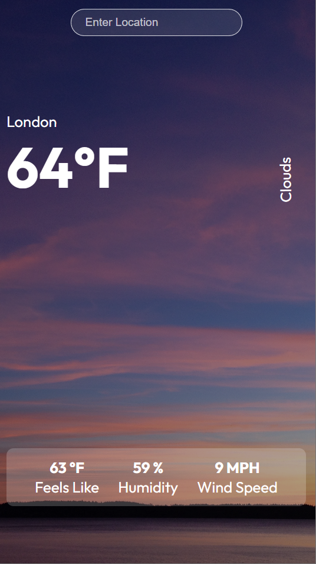

<br/>
<p align="center">
    <a href="(https://react.dev/)">
    
  </a>
  <h3 align="center">Weather App</h3>
</p>

      

## About The Project

This project brings the weather information according to the city information entered by the users. According to the location information received from the user, it contains detailed information such as temperature, humidity, and wind values in the target city, as well as summary information about the weather of that day. The application has a very simple and modern interface.

## Built With

Weather App is a React.js project and has been developed following the ECMAScript 6+ standards of the JavaScript programming language. Axios library was included in the project and weather information was obtained with Weather API provided by the "OpenWeather" site. CSS features were included in the project by using SCSS preprocessor in the interface design and weather information was presented to the users of the application with a user-friendly interface. Finally, after the ".env" and ".gitignore" files were created in terms of security, the project was put into service as open source.

* [JavaScript](https://www.w3schools.com/js/)
* [React ](https://react.dev/)
* [Axios](https://axios-http.com/docs/intro)
* [CSS](https://developer.mozilla.org/en-US/docs/Web/CSS)
* [SASS](https://sass-lang.com/)

## Getting Started

This is an example of how you may give instructions on setting up your project locally.
To get a local copy up and running follow these simple example steps.

### Prerequisites

This is an example of how to list things you need to use the software and how to install them.

* npm

```sh
npm install npm@latest -g
```

### Installation

1. Get a free API Key at (https://openweathermap.org/)

2. Clone the repo

```sh
git clone https://github.com/FiratCanTas/React-Weather-App.git
```

3. Install NPM packages

```sh
npm install
```

4. Enter your API in `App.js`

```JS
const URL = 'ENTER YOUR API WITH API KEY';
```
